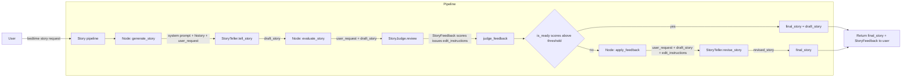

```mermaid
flowchart LR
    U[User] -->|bedtime story request| G[Story pipeline]

    subgraph Pipeline
        direction LR

        %% 1) Generate story
        G --> GS[Node: generate_story]
        GS -->|system prompt + history + user_request| ST[StoryTeller.tell_story]
        ST -->|draft_story| EV[Node: evaluate_story]

        %% 2) Judge story
        EV -->|user_request + draft_story| J[StoryJudge.review]
        J -->|StoryFeedback scores issues edit_instructions| FB[judge_feedback]

        %% 3) Decide: ready or needs revision
        FB --> DEC{is_ready scores above threshold}
        DEC -->|yes| FINAL_PASS[final_story = draft_story]
        DEC -->|no| AP[Node: apply_feedback]

        %% 4) Revise story if needed
        AP -->|user_request + draft_story + edit_instructions| STR[StoryTeller.revise_story]
        STR -->|revised_story| FINAL_REV[final_story]

    end

    %% Output to user
    FINAL_PASS --> OUT[Return final_story + StoryFeedback to user]
    FINAL_REV --> OUT


```